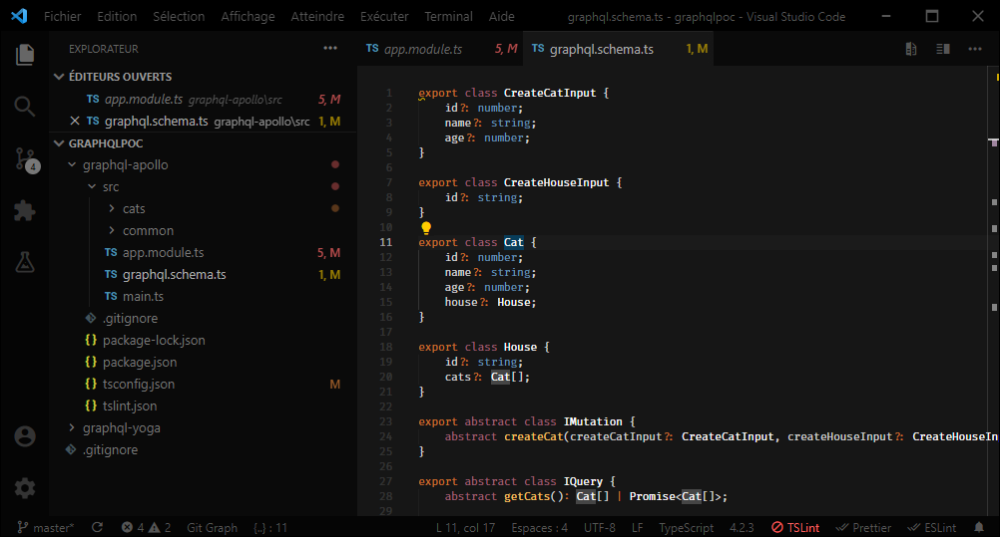

## Installation

Execute below line in the **command palette** (**F1**/**Ctrl+Shift+P**):

```
ext install oub.zen-dark
```

## Issues

Please report all the errors and/or annoyances that you see on the [issues](https://github.com/oub/vscode-zen-dark/issues) page.